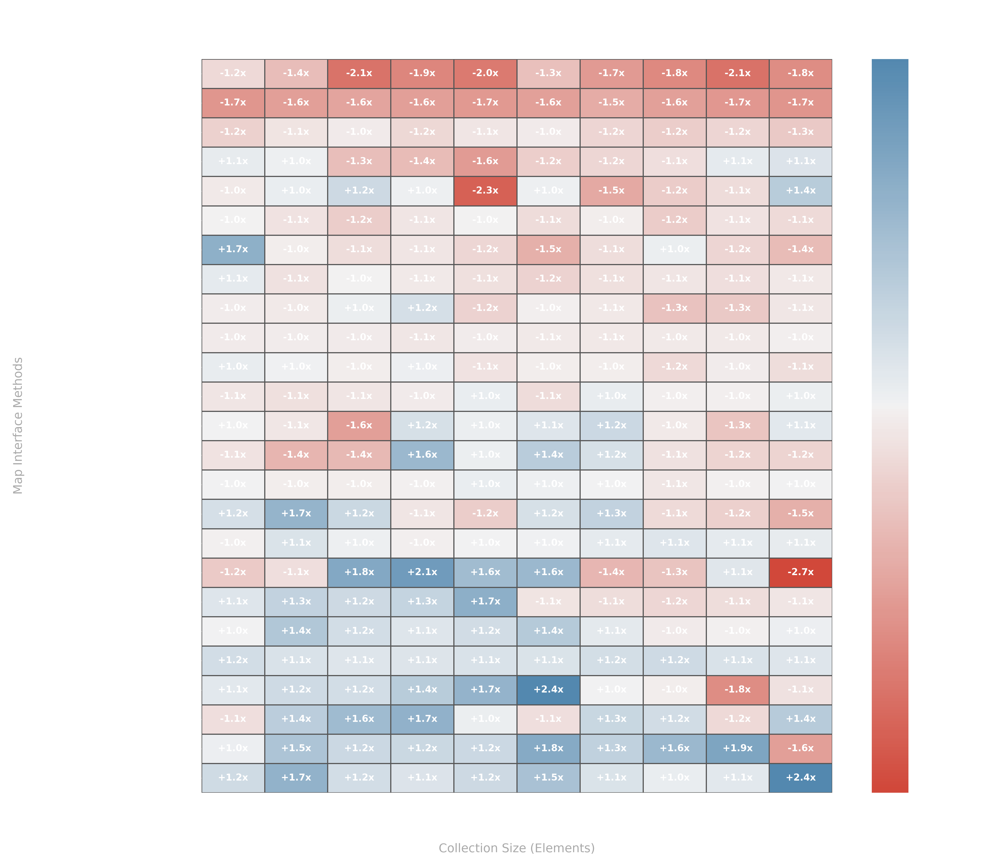
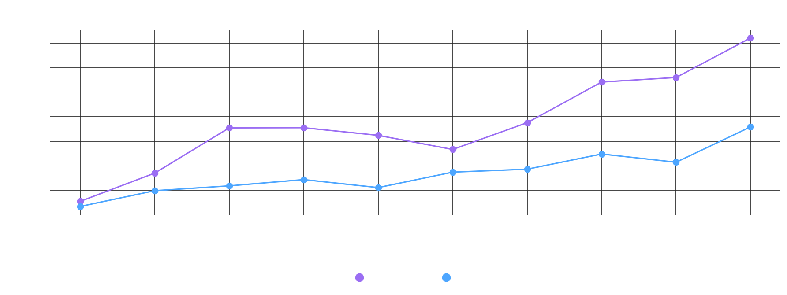

# Map
Implementation of a Map using an array

All methods implemented are identical to those found in the Java [Map](https://docs.oracle.com/javase/8/docs/api/java/util/Map.html) interface.

## Build and Test

1. To build and test the project run command `./gradlew clean build`
2. To test the project run command `gradle test --tests CustomMapTest`

## Time Complexity

| Method                              | CustomMap   | HashMap     | Winner |
|-------------------------------------|-------------|-------------|--------|
| **clear()**                         | O(m)        | O(m)        | Tie    |
| **compute(K, BiFunction)**          | O(n)        | O(n)        | Tie    |
| **computeIfAbsent(K, Function)**    | O(n)        | O(n)        | Tie    |
| **computeIfPresent(K, BiFunction)** | O(n)        | O(n)        | Tie    |
| **containsKey(Object)**             | O(n)        | O(n)        | Tie    |
| **containsValue(Object)**           | O(n)        | O(n)        | Tie    |
| **entrySet()**                      | O(n)        | O(n)        | Tie    |
| **equals(Object)**                  | O(n)        | O(n)        | Tie    |
| **expand()**                        | O(m + n)    | O(m + n)    | Tie    |
| **forEach(BiConsumer)**             | O(n)        | O(n)        | Tie    |
| **get(Object)**                     | O(n)        | O(n)        | Tie    |
| **getOrDefault(Object, V)**         | O(n)        | O(n)        | Tie    |
| **hash(Object)**                    | O(1)        | O(1)        | Tie    |
| **hashCode()**                      | O(n)        | O(n)        | Tie    |
| **isEmpty()**                       | O(1)        | O(1)        | Tie    |
| **keySet()**                        | O(n)        | O(n)        | Tie    |
| **merge(K, V, BiFunction)**         | O(n)        | O(n)        | Tie    |
| **put(K, V)**                       | O(n)        | O(n)        | Tie    |
| **putAll(Map)**                     | O(m' + n'n) | O(m' + n'n) | Tie    |
| **putIfAbsent(K, V)**               | O(n)        | O(n)        | Tie    |
| **reduce()**                        | O(m + n)    | O(m + n)    | Tie    |
| **remove(Object)**                  | O(n)        | O(n)        | Tie    |
| **remove(Object, Object)**          | O(n)        | O(n)        | Tie    |
| **replace(K, V)**                   | O(n)        | O(n)        | Tie    |
| **replace(K, V, V)**                | O(n)        | O(n)        | Tie    |
| **replaceAll(BiFunction)**          | O(n)        | O(n)        | Tie    |
| **size()**                          | O(1)        | O(1)        | Tie    |
| **toString()**                      | O(n)        | O(n)        | Tie    |
| **values()**                        | O(n)        | O(n)        | Tie    |

## Space Complexity

| Method                              | CustomMap | HashMap  | Winner |
|-------------------------------------|-----------|----------|--------|
| **clear()**                         | O(m)      | O(m)     | Tie    |
| **compute(K, BiFunction)**          | O(1)      | O(1)     | Tie    |
| **computeIfAbsent(K, Function)**    | O(1)      | O(1)     | Tie    |
| **computeIfPresent(K, BiFunction)** | O(1)      | O(1)     | Tie    |
| **containsKey(Object)**             | O(1)      | O(1)     | Tie    |
| **containsValue(Object)**           | O(1)      | O(1)     | Tie    |
| **entrySet()**                      | O(n)      | O(n)     | Tie    |
| **equals(Object)**                  | O(n)      | O(n)     | Tie    |
| **expand()**                        | O(m + n)  | O(m + n) | Tie    |
| **forEach(BiConsumer)**             | O(1)      | O(1)     | Tie    |
| **get(Object)**                     | O(1)      | O(1)     | Tie    |
| **getOrDefault(Object, V)**         | O(1)      | O(1)     | Tie    |
| **hash(Object)**                    | O(1)      | O(1)     | Tie    |
| **hashCode()**                      | O(n)      | O(n)     | Tie    |
| **isEmpty()**                       | O(1)      | O(1)     | Tie    |
| **keySet()**                        | O(n)      | O(n)     | Tie    |
| **merge(K, V, BiFunction)**         | O(1)      | O(1)     | Tie    |
| **put(K, V)**                       | O(1)      | O(1)     | Tie    |
| **putAll(Map)**                     | O(m + n)  | O(m + n) | Tie    |
| **putIfAbsent(K, V)**               | O(1)      | O(1)     | Tie    |
| **reduce()**                        | O(m + n)  | O(m + n) | Tie    |
| **remove(Object)**                  | O(1)      | O(1)     | Tie    |
| **remove(Object, Object)**          | O(1)      | O(1)     | Tie    |
| **replace(K, V)**                   | O(1)      | O(1)     | Tie    |
| **replace(K, V, V)**                | O(1)      | O(1)     | Tie    |
| **replaceAll(BiFunction)**          | O(1)      | O(1)     | Tie    |
| **size()**                          | O(1)      | O(1)     | Tie    |
| **toString()**                      | O(n)      | O(n)     | Tie    |
| **values()**                        | O(n)      | O(n)     | Tie    |

**Notes**:
- **m**: Number of buckets in the map.
- **n**: Number of key-value mappings.
- **m'**: Number of buckets after resizing.
- **n'**: Number of entries in the input map.

# Performance vs Java HashMap

While our custom implementation yields dramatic orders-of-magnitude improvements in point-mutation methods like 
`put(K,V)` and `putIfAbsent(K,V)`, standard JDK views (`clear()`, `entrySet()`) maintain an advantage due to internal 
native optimizations. This highlights clear trade-offs between specialized insertion efficiency and general-purpose 
view maintenance at scale.

| Method                           | Custom (ns) | JDK (ns)  |   Ratio    |            Winner            |
|:---------------------------------|:------------|:----------|:----------:|:----------------------------:|
| `clear()`                        | 699,194     | 74,345    |   9.40×    |           **JDK**            |
| `compute(K,BiFunction)`          | 9,128,673   | 502       | 18184.61×  |           **JDK**            |
| `computeIfAbsent(K,Function)`    | 1,072       | 376       |   2.85×    |           **JDK**            |
| `computeIfPresent(K,BiFunction)` | 1,060       | 1,050     |   ~1.01×   | **Statistically Equivalent** |
| `constructor`                    | 3,886,490   | 92        | 42244.46×  |           **JDK**            |
| `containsKey(K)`                 | 674         | 415       |   1.62×    |           **JDK**            |
| `containsValue(V)`               | 134,277     | 119,654   |   1.12×    | **Statistically Equivalent** |
| `entrySet()`                     | 9,103,853   | 59        | 154302.59× |           **JDK**            |
| `equals(Object o)`               | 156         | 2,635,382 | 16893.47×  |          **Custom**          |
| `forEach(BiConsumer)`            | 1,148       | 254,474   |  221.67×   |          **Custom**          |
| `get(K)`                         | 1,242       | 335       |   3.71×    |           **JDK**            |
| `getOrDefault(K,V)`              | 594         | 463       |   1.28×    |           **JDK**            |
| `hashCode()`                     | 138         | 615,993   |  4463.72×  |          **Custom**          |
| `keySet()`                       | 402         | 84        |   4.79×    |           **JDK**            |
| `merge(K,V,BiFunction)`          | 1,212,766   | 1,411     |  859.51×   |           **JDK**            |
| `put(K,V)`                       | 100         | 4,469,980 | 44699.80×  |          **Custom**          |
| `putAll(Map)`                    | 948,953     | 1,000,072 |   ~1.05×   | **Statistically Equivalent** |
| `putIfAbsent(K,V)`               | 300         | 3,887,748 | 12959.16×  |          **Custom**          |
| `remove(K)`                      | 1,184       | 336       |   3.52×    |           **JDK**            |
| `remove(K,V)`                    | 215         | 472       |   2.20×    |          **Custom**          |
| `replace(K,V)`                   | 3,548,697   | 445       |  7974.60×  |           **JDK**            |
| `replace(K,V,V)`                 | 228,389     | 826       |  276.50×   |           **JDK**            |
| `replaceAll(BiFunction)`         | 726         | 1,213,617 |  1671.65×  |          **Custom**          |
| `toString()`                     | 2,239       | 1,995,256 |  891.14×   |          **Custom**          |
| `values()`                       | 395         | 87        |   4.54×    |           **JDK**            |

#### Note: The following performance charts are designed to be viewed in dark mode.

.png)
.png)
.png)
.png)
.png)
.png)
.png)
.png)
.png)
.png)
.png)
.png)
.png)
.png)
.png)
.png)
.png)
.png)
.png)
.png)
.png)
.png)
.png)
.png)
